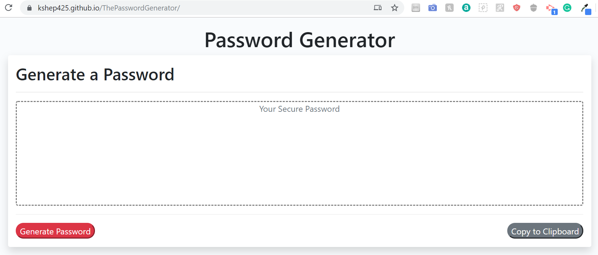

# The Password Generator
[Password Generator](https://kshep425.github.io/ThePasswordGenerator/)
<a href="https://kshep425.github.io/ThePasswordGenerator/" target="_blank">
The Password Generator Home Page

  

</a>

## Description
A tool to generate passwords.

## Usage
By selecting Generate Password button, the user will be prompted to:

1. Enter the length of the password between 8 and 128 characters.
1. Confirm if you want to include the following characters types in your password:
    1. Special Characters such as !@#$%^&*()
    1. Numbers 1234567890
    1. lowercase letters
    1. uppercase letters

